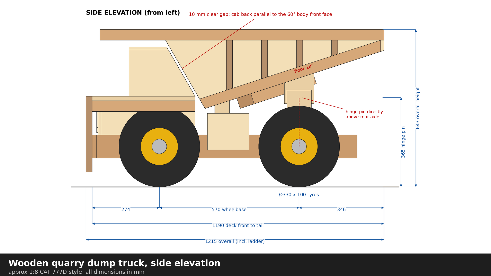

# Wooden quarry dump truck plans

Workshop plans for a large wooden quarry dump truck model, about 1:8 scale and styled on a Caterpillar 777D, with a tipping wedge body and a canopy over the cab.

**[Download the plans (PDF, 12 A3 sheets)](wooden-dump-truck-plans.pdf)**

- **Size:** 643 mm high to the top of the canopy, 1190 mm long (1215 mm with the ladder), 700 mm wide.
- **Materials:** one 2440 x 1220 sheet of 12 mm plywood, small pieces of 18 mm and 6 mm ply, planed (PAR) softwood, 12 mm dowel, two 20 mm steel axle bars, and six bought 330 mm puncture-proof wheels.
- **Tipping:** the body tips to 45 degrees on a hinge directly above the rear axle, with a fold-down prop to hold it up.

## What's in the PDF

1. General arrangement: side, front and plan views, with a scale check against the real truck.
2. Sheets 2 to 9: every part drawn on its own, with sizes, hole positions and materials, plus the wedge body and hinge set-out.
3. Sheet 10: cutting list, including the angled cuts and bevels.
4. Sheet 11: plywood cutting layouts and the buying list.
5. Sheet 12: assembly order and wheel details.

The plans were checked before publishing: every pair of parts that touch was compared for matching sizes, and the body was tested for clashes at every 5 degrees from down to fully tipped.

Designed for Tony Hine with his Grok Bot assistant. Check all sizes against your own timber before cutting.

Reference photo of the real Caterpillar 777D: [Jo Mateix, public domain, Wikimedia Commons](https://commons.wikimedia.org/wiki/File:Caterpillar_777D.jpg).
